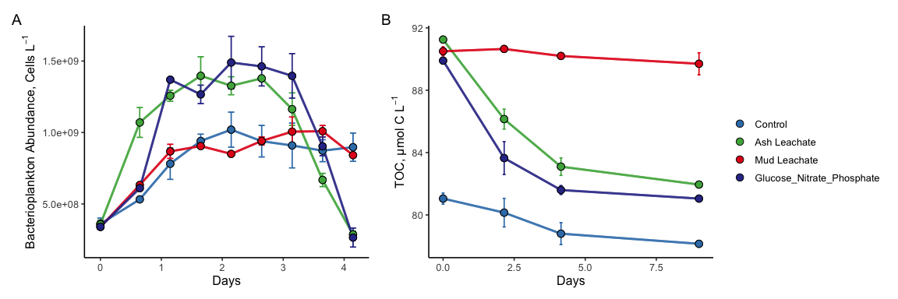

Combined\_TOC
================
Nicholas Baetge
6/21/2021

# Intro

This document shows how **individual bottle** TOC/DOC data from ACIDD
remineralization experiments were processed, QC’d, and analyzed.

``` r
library(tidyverse)
library(readxl)
library(lubridate)
library(ggpubr)
```

# Import Data

``` r
acidd_metadata <- read_excel("~/GITHUB/acidd_remins/input/ACIDD_Exp_TOC.xlsx", sheet = "Metadata")

acidd_data <- read_excel("~/GITHUB/acidd_remins/input/ACIDD_Exp_TOC.xlsx", sheet = "Data")

class_metadata <- read_excel("~/GITHUB/acidd_remins/input/144L_2018_Exp_TOC.xlsx", sheet = "Metadata")

class_data <- read_excel("~/GITHUB/acidd_remins/input/144L_2018_Exp_TOC.xlsx", sheet = "Data")

mud_data <- read_excel("~/GITHUB/acidd_remins/input/Mud19-1_DOC.xlsx", sheet = "summary")

acidd_joined <- left_join(acidd_metadata, acidd_data)
```

    ## Joining, by = c("Experiment", "Bottle", "Timepoint")

``` r
class_joined <- left_join(class_metadata, class_data)
```

    ## Joining, by = c("Bottle", "Timepoint")

``` r
joined <- full_join(acidd_joined, class_joined) %>% 
  full_join(., mud_data)
```

    ## Joining, by = c("Experiment", "Location", "Temperature_C", "Depth", "Bottle", "Timepoint", "Treatment", "Target_DOC_Amendment_uM", "Inoculum_L", "Media_L", "Datetime", "TOC_Sample", "Parallel_Sample", "Cell_Sample", "DNA_Sample", "DNA_SampleID", "TOC", "TOC_sd", "PTOC", "PTOC_sd")

    ## Joining, by = c("Experiment", "Location", "Temperature_C", "Depth", "Bottle", "Timepoint", "Treatment", "Target_DOC_Amendment_uM", "Inoculum_L", "Media_L", "Datetime", "PTOC", "PTOC_sd")

# Prepare data

``` r
toc <- joined %>% 
  mutate(Datetime = ymd_hm(Datetime)) %>% 
  group_by(Experiment, Bottle) %>% 
  mutate(interv = interval(first(Datetime), Datetime),
         hours = as.numeric(interv/3600), 
         days = hours/24) %>% 
  ungroup() %>% 
  rename(sd_TOC = TOC_sd,
         sd_PTOC = PTOC_sd) %>%
  select(Experiment:Datetime, hours, days, everything(), -c(contains("Sample"), interv))
```

# Plot curves

``` r
levels <- c("Control", "Ash Leachate", "Mud Leachate", "UV-Mud Leachate", "Glucose_Nitrate_Phosphate", "San Diego", "Santa Barbara", "Campus Point", "Goleta Beach")

custom.colors <- c("Control" = "#377EB8", "Ash Leachate" = "#4DAF4A", "Mud Leachate" = "#E41A1C", "UV-Mud Leachate" = "#FF7F00", "Glucose_Nitrate_Phosphate" = "#313695", "Santa Barbara" = "#E41A1C", "San Diego" = "#FF7F00")

toc_curves <- toc %>% 
  drop_na(PTOC) %>% 
  # mutate(dna = ifelse(DNA_Sample == T, "*", NA)) %>% 
  ggplot(aes(x = days, y = PTOC, group = interaction(Experiment, Treatment, Bottle))) +
  geom_errorbar(aes(ymin = PTOC - sd_PTOC, ymax = PTOC + sd_PTOC, color = factor(Treatment, levels = levels)), width = 0.1) +
  geom_line(aes(color = factor(Treatment, levels = levels)), size = 1, alpha = 0.7) +
  geom_point(aes(fill = factor(Treatment, levels = levels)), size = 3, color = "black", shape = 21) +
  # geom_text(aes(label = dna), size = 12,  color = "#E41A1C") +
  labs(x = "Days", y = expression(paste("TOC, µmol C L"^-1)), fill = "") +
  guides(color = F) +
  scale_color_manual(values = custom.colors) +
  scale_fill_manual(values = custom.colors) +
  facet_grid(~factor(Location, levels = levels), scales = "free") +
  theme_classic2() 
```

``` r
sb_toc_curves <- toc %>% 
  drop_na(PTOC) %>% 
  group_by(Experiment, Treatment, Timepoint) %>% 
  mutate(mean = mean(PTOC, na.rm = T),
         sd = sd(PTOC, na.rm = T)) %>% 
  ungroup() %>% 
  select(-c(PTOC, sd_PTOC)) %>% 
  distinct() %>% 
  filter(Location == "Santa Barbara") %>% 
  # mutate(dna = ifelse(DNA_Sample == T, "*", NA)) %>% 
  ggplot(aes(x = days, y = mean, group = interaction(Experiment, Treatment, Bottle))) +
  geom_errorbar(aes(ymin = mean - sd, ymax = mean + sd, color = factor(Treatment, levels = levels)), width = 0.1) +
  geom_line(aes(color = factor(Treatment, levels = levels)), size = 1, alpha = 0.7) +
  geom_point(aes(fill = factor(Treatment, levels = levels)), size = 3, color = "black", shape = 21) +
  # geom_text(aes(label = dna), size = 12,  color = "#E41A1C") +
  labs(x = "Days", y = expression(paste("TOC, µmol C L"^-1)), fill = "") +
  guides(color = F) +
  scale_color_manual(values = custom.colors) +
  scale_fill_manual(values = custom.colors) +
  theme_classic2() 
```

``` r
cp_toc_curves <- toc %>% 
  drop_na(PTOC) %>% 
  group_by(Experiment, Treatment, Timepoint) %>% 
  mutate(mean = mean(PTOC, na.rm = T),
         sd = sd(PTOC, na.rm = T)) %>% 
  ungroup() %>% 
  select(-c(PTOC, sd_PTOC)) %>% 
  distinct() %>% 
  filter(Location == "Campus Point") %>% 
  # mutate(dna = ifelse(DNA_Sample == T, "*", NA)) %>% 
  ggplot(aes(x = days, y = mean, group = interaction(Experiment, Treatment, Bottle))) +
  geom_errorbar(aes(ymin = mean - sd, ymax = mean + sd, color = factor(Treatment, levels = levels)), width = 0.1) +
  geom_line(aes(color = factor(Treatment, levels = levels)), size = 1, alpha = 0.7) +
  geom_point(aes(fill = factor(Treatment, levels = levels)), size = 3, color = "black", shape = 21) +
  # geom_text(aes(label = dna), size = 12,  color = "#E41A1C") +
  labs(x = "Days", y = expression(paste("TOC, µmol C L"^-1)), fill = "") +
  guides(color = F) +
  scale_color_manual(values = custom.colors) +
  scale_fill_manual(values = custom.colors) +
  theme_classic2() 
```

``` r
gb_toc_curves <- toc %>% 
  drop_na(PTOC) %>% 
  group_by(Experiment, Treatment, Timepoint) %>% 
  mutate(mean = mean(PTOC, na.rm = T),
         sd = sd(PTOC, na.rm = T)) %>% 
  ungroup() %>% 
  select(-c(PTOC, sd_PTOC)) %>% 
  distinct() %>% 
  filter(Location == "Goleta Beach") %>% 
  # mutate(dna = ifelse(DNA_Sample == T, "*", NA)) %>% 
  ggplot(aes(x = days, y = mean, group = interaction(Experiment, Treatment, Bottle))) +
  geom_errorbar(aes(ymin = mean - sd, ymax = mean + sd, color = factor(Treatment, levels = levels)), width = 0.1) +
  geom_line(aes(color = factor(Treatment, levels = levels)), size = 1, alpha = 0.7) +
  geom_point(aes(fill = factor(Treatment, levels = levels)), size = 3, color = "black", shape = 21) +
  # geom_text(aes(label = dna), size = 12,  color = "#E41A1C") +
  labs(x = "Days", y = expression(paste("TOC, µmol C L"^-1)), fill = "") +
  guides(color = F) +
  scale_color_manual(values = custom.colors) +
  scale_fill_manual(values = custom.colors) +
  theme_classic2() 
```

# Save data

``` r
saveRDS(toc_curves, "~/GITHUB/acidd_remins/output/toc_curves.rds")
saveRDS(sb_toc_curves, "~/GITHUB/acidd_remins/output/sb_toc_curves.rds")
saveRDS(cp_toc_curves, "~/GITHUB/acidd_remins/output/cp_toc_curves.rds")
saveRDS(gb_toc_curves, "~/GITHUB/acidd_remins/output/gb_toc_curves.rds")
saveRDS(toc, "~/GITHUB/acidd_remins/input/tidy_TOC_Remin_Master.rds")
```

``` r
ba_toc <- read_rds("~/GITHUB/acidd_remins/input/tidy_BactA_Remin_Master.rds") %>% 
  full_join(. , toc)
```

    ## Joining, by = c("Experiment", "Location", "Temperature_C", "Depth", "Bottle", "Timepoint", "Treatment", "Target_DOC_Amendment_uM", "Inoculum_L", "Media_L", "Datetime", "hours", "days")

``` r
saveRDS(ba_toc, "~/GITHUB/acidd_remins/input/tidy_combined_data.rds")
```

``` r
library(patchwork)
```

``` r
sb_ba_curves <- readRDS("~/GITHUB/acidd_remins/output/sb_ba_curves.rds")
cp_ba_curves <- readRDS("~/GITHUB/acidd_remins/output/cp_ba_curves.rds")
gb_ba_curves <- readRDS("~/GITHUB/acidd_remins/output/gb_ba_curves.rds")
```

``` r
sb_ba_curves + (sb_toc_curves + guides(fill = F)) + plot_layout(guides = "collect") & plot_annotation(, tag_levels = "A")
```

<!-- -->

``` r
cp_ba_curves + (cp_toc_curves + guides(fill = F)) + plot_layout(guides = "collect") & plot_annotation(, tag_levels = "A")
```

<!-- -->

``` r
gb_ba_curves + (gb_toc_curves + guides(fill = F)) + plot_layout(guides = "collect") & plot_annotation(, tag_levels = "A")
```

<!-- -->
