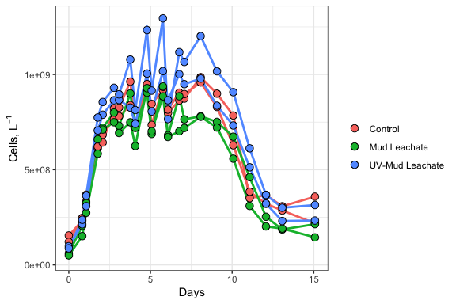
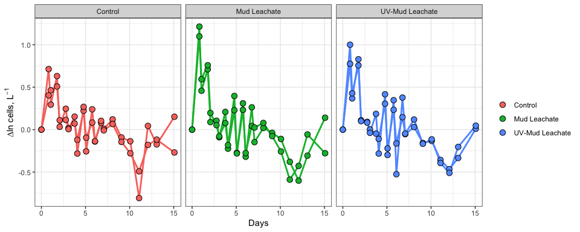
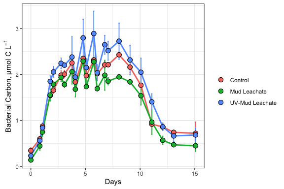
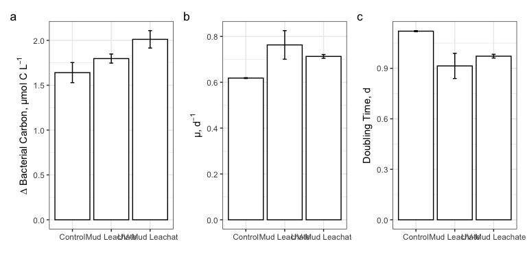

Mud191\_BactAbund
================
Nicholas Baetge
3/18/2021

# Intro

This document shows how **individual bottle** bacterial abundance data
from Mud experiments were processed, QC’d, and analyzed.

``` r
library(tidyverse)
library(readxl)
library(lubridate)
```

# Import data

``` r
excel_sheets("~/GITHUB/acidd_remins/input/Mud191_BactAbund.xlsx")
```

    ## [1] "Sheet1"

``` r
data <- read_excel("~/GITHUB/acidd_remins/input/Mud191_BactAbund.xlsx", sheet = "Sheet1")
glimpse(data)
```

    ## Rows: 228
    ## Columns: 5
    ## $ Treatment <chr> "Control", "Control", "Control", "Control", "Control", "Con…
    ## $ Bottle    <chr> "A", "A", "A", "A", "A", "A", "A", "A", "A", "A", "A", "A",…
    ## $ Timepoint <dbl> 0.0, 0.0, 0.5, 0.5, 1.0, 1.0, 1.5, 1.5, 2.0, 2.0, 2.5, 2.5,…
    ## $ Datetime  <chr> "2019-03-04T15:15", "2019-03-04T15:15", "2019-03-05T11:00",…
    ## $ cells_ml  <dbl> 153402.0, 155803.4, 224707.5, 238488.9, 358839.6, 377769.5,…

# Prepare data

Convert date and time column values from characters to dates, add
columns with time elapsed for each experiment, and convert cells/ml to
cells/l, subset data to select only VOI & drop na’s

``` r
cells <- data %>% 
  mutate(Datetime = ymd_hm(Datetime),
         cells = cells_ml * 1000,
         Experiment = "MUD_19-1") %>% 
  group_by(Treatment, Bottle, Timepoint) %>% 
  mutate(ave_cells = mean(cells, na.rm = T),
         sd_cells = sd(cells, na.rm = T)) %>% 
  ungroup() %>% 
  select(Experiment, Treatment:Datetime, ave_cells, sd_cells) %>% 
  rename(cells = ave_cells) %>% 
  group_by(Experiment, Treatment, Bottle) %>% 
  mutate(interv = interval(first(Datetime), Datetime),
         hours = as.numeric(interv/3600),
         days = hours/24) %>% 
  ungroup() %>% 
  select(Experiment:Datetime, hours, days, cells, sd_cells) %>% 
  drop_na(cells) %>% 
  filter(Treatment != "Amendment") %>% 
  distinct()

glimpse(cells)
```

    ## Rows: 132
    ## Columns: 9
    ## $ Experiment <chr> "MUD_19-1", "MUD_19-1", "MUD_19-1", "MUD_19-1", "MUD_19-1"…
    ## $ Treatment  <chr> "Control", "Control", "Control", "Control", "Control", "Co…
    ## $ Bottle     <chr> "A", "A", "A", "A", "A", "A", "A", "A", "A", "A", "A", "A"…
    ## $ Timepoint  <dbl> 0.0, 0.5, 1.0, 1.5, 2.0, 2.5, 3.0, 3.5, 4.0, 4.5, 5.0, 5.5…
    ## $ Datetime   <dttm> 2019-03-04 15:15:00, 2019-03-05 11:00:00, 2019-03-05 16:4…
    ## $ hours      <dbl> 0.00000, 19.75000, 25.50000, 42.50000, 49.75000, 66.33333,…
    ## $ days       <dbl> 0.0000000, 0.8229167, 1.0625000, 1.7708333, 2.0729167, 2.7…
    ## $ cells      <dbl> 154602679, 231598165, 368304590, 612230682, 683652839, 766…
    ## $ sd_cells   <dbl> 1698075.71, 9744921.25, 13385449.91, 2531356.15, 11762960.…

# Plot growth curves

``` r
levels <- c("Control", "Mud Leachate", "UV-Mud Leachate")

cells %>% 
  ggplot(aes(x = days, y = cells, group = interaction(Experiment, Treatment, Bottle))) +
  geom_errorbar(aes(ymin = cells - sd_cells, ymax = cells + sd_cells, color = factor(Treatment, levels = levels)), width = 0.1) +
  geom_line(aes(color = factor(Treatment, levels = levels)), size = 1) +
  geom_point(aes(fill = factor(Treatment, levels = levels)), size = 3, color = "black", shape = 21) +
  labs(x = "Days", y = expression(paste("Cells, L"^-1)), fill = "") +
  guides(color = F) +
  # scale_color_manual(values = custom.colors) +
  # scale_fill_manual(values = custom.colors) +
  theme_bw() 
```

<!-- -->

We can calculate:

  - The total change in cells from the initial condition to the end of
    the experiment
  - Specific growth rates as the slope of ln(abundnace) v time during
    the exponential growth phase
  - Doubling time as ln(2) divided by the specific growth rate
  - The mean of each of these parameters for each treatment

First we’ll need to determine where exponential growth occurs in each of
the experiments, if it does. So let’s plot ln(abundance) v time.

# Identify exponential phase of growth

**NOTE about logarithms in R**

log(x) gives the natural log of x, not log base 10. log10(x) gives the
log base 10 log2(x) gives log base 2

``` r
ln_cells <- cells %>% 
  group_by(Experiment, Treatment, Bottle) %>% 
  mutate(ln_cells = log(cells),
         diff_ln_cells = ln_cells - lag(ln_cells, default = first(ln_cells))) %>% 
  ungroup()
```

``` r
ln_cells %>% 
  ggplot(aes(x = days, y = diff_ln_cells, group = interaction(Experiment, Treatment, Bottle))) +
  geom_line(aes(color = factor(Treatment, levels = levels)), size = 1) +
  geom_point(aes(fill = factor(Treatment, levels = levels)), size = 3, color = "black", shape = 21) +
  labs(x = "Days", y = expression(paste("∆ln cells, L"^-1)), fill = "") +
  guides(color = F) +
  facet_grid(~Treatment) +
  # scale_color_manual(values = custom.colors) +
  # scale_fill_manual(values = custom.colors) +
  theme_bw() 
```

<!-- -->

This plot makes it little easier to see, with the data that we have,
that exponential growth occurs for each bottle: ~0.5-2.5 d (T0.5-T2.5)

# Calculate growth rates, doubling times, and ∆cell abundances

``` r
growth <- ln_cells %>% 
  mutate(exp_start = 0.5,
         exp_end = 2.5) %>% 
  group_by(Experiment, Treatment, Bottle) %>% 
  mutate(ln_cells_exp_start = ifelse(Timepoint == exp_start, ln_cells, NA), 
         ln_cells_exp_end = ifelse(Timepoint == exp_end, ln_cells, NA), 
         cells_exp_start = ifelse(Timepoint == exp_start, cells, NA), 
         cells_exp_end = ifelse(Timepoint == exp_end, cells, NA), 
         days_exp_start = ifelse(Timepoint == exp_start, days, NA), 
         days_exp_end = ifelse(Timepoint == exp_end, days, NA), ) %>% 
  fill(ln_cells_exp_start:days_exp_end, .direction = "updown") %>% 
  mutate(mew = (ln_cells_exp_end - ln_cells_exp_start)/(days_exp_end - days_exp_start), 
         doubling = log(2)/mew,
         delta_cells = cells_exp_end - first(cells)) %>% 
  ungroup()

glimpse(growth)
```

    ## Rows: 132
    ## Columns: 22
    ## $ Experiment         <chr> "MUD_19-1", "MUD_19-1", "MUD_19-1", "MUD_19-1", "M…
    ## $ Treatment          <chr> "Control", "Control", "Control", "Control", "Contr…
    ## $ Bottle             <chr> "A", "A", "A", "A", "A", "A", "A", "A", "A", "A", …
    ## $ Timepoint          <dbl> 0.0, 0.5, 1.0, 1.5, 2.0, 2.5, 3.0, 3.5, 4.0, 4.5, …
    ## $ Datetime           <dttm> 2019-03-04 15:15:00, 2019-03-05 11:00:00, 2019-03…
    ## $ hours              <dbl> 0.00000, 19.75000, 25.50000, 42.50000, 49.75000, 6…
    ## $ days               <dbl> 0.0000000, 0.8229167, 1.0625000, 1.7708333, 2.0729…
    ## $ cells              <dbl> 154602679, 231598165, 368304590, 612230682, 683652…
    ## $ sd_cells           <dbl> 1698075.71, 9744921.25, 13385449.91, 2531356.15, 1…
    ## $ ln_cells           <dbl> 18.85637, 19.26051, 19.72442, 20.23262, 20.34296, …
    ## $ diff_ln_cells      <dbl> 0.00000000, 0.40414536, 0.46390646, 0.50819886, 0.…
    ## $ exp_start          <dbl> 0.5, 0.5, 0.5, 0.5, 0.5, 0.5, 0.5, 0.5, 0.5, 0.5, …
    ## $ exp_end            <dbl> 2.5, 2.5, 2.5, 2.5, 2.5, 2.5, 2.5, 2.5, 2.5, 2.5, …
    ## $ ln_cells_exp_start <dbl> 19.26051, 19.26051, 19.26051, 19.26051, 19.26051, …
    ## $ ln_cells_exp_end   <dbl> 20.45730, 20.45730, 20.45730, 20.45730, 20.45730, …
    ## $ cells_exp_start    <dbl> 231598165, 231598165, 231598165, 231598165, 231598…
    ## $ cells_exp_end      <dbl> 766467301, 766467301, 766467301, 766467301, 766467…
    ## $ days_exp_start     <dbl> 0.8229167, 0.8229167, 0.8229167, 0.8229167, 0.8229…
    ## $ days_exp_end       <dbl> 2.763889, 2.763889, 2.763889, 2.763889, 2.763889, …
    ## $ mew                <dbl> 0.6165921, 0.6165921, 0.6165921, 0.6165921, 0.6165…
    ## $ doubling           <dbl> 1.124158, 1.124158, 1.124158, 1.124158, 1.124158, …
    ## $ delta_cells        <dbl> 611864622, 611864622, 611864622, 611864622, 611864…

# Convert bacterial abundance & change in bacterial abundance to carbon units

Apply a carbon conversion factor (CCF) to bacterial abundances (cells
L<sup>-1</sup>) to generate bacterial carbon (µmol C L<sup>-1</sup>)

We’ll apply the average carbon content of bacterioplankton cells from
Coastal Japan (~30 fg C cell<sup>-1</sup>), reported by [Fukuda et
al., 1998](https://aem.asm.org/content/64/9/3352). This CCF was used in
previous experiments conducted in the SBC: [James et
al., 2017](https://journals.plos.org/plosone/article?id=10.1371/journal.pone.0173145)

``` r
bactcarbon <- growth %>% 
  mutate(bc = cells * (2.5 * 10^-9), 
         delta_bc = delta_cells * (2.5 * 10^-9))

glimpse(bactcarbon)
```

    ## Rows: 132
    ## Columns: 24
    ## $ Experiment         <chr> "MUD_19-1", "MUD_19-1", "MUD_19-1", "MUD_19-1", "M…
    ## $ Treatment          <chr> "Control", "Control", "Control", "Control", "Contr…
    ## $ Bottle             <chr> "A", "A", "A", "A", "A", "A", "A", "A", "A", "A", …
    ## $ Timepoint          <dbl> 0.0, 0.5, 1.0, 1.5, 2.0, 2.5, 3.0, 3.5, 4.0, 4.5, …
    ## $ Datetime           <dttm> 2019-03-04 15:15:00, 2019-03-05 11:00:00, 2019-03…
    ## $ hours              <dbl> 0.00000, 19.75000, 25.50000, 42.50000, 49.75000, 6…
    ## $ days               <dbl> 0.0000000, 0.8229167, 1.0625000, 1.7708333, 2.0729…
    ## $ cells              <dbl> 154602679, 231598165, 368304590, 612230682, 683652…
    ## $ sd_cells           <dbl> 1698075.71, 9744921.25, 13385449.91, 2531356.15, 1…
    ## $ ln_cells           <dbl> 18.85637, 19.26051, 19.72442, 20.23262, 20.34296, …
    ## $ diff_ln_cells      <dbl> 0.00000000, 0.40414536, 0.46390646, 0.50819886, 0.…
    ## $ exp_start          <dbl> 0.5, 0.5, 0.5, 0.5, 0.5, 0.5, 0.5, 0.5, 0.5, 0.5, …
    ## $ exp_end            <dbl> 2.5, 2.5, 2.5, 2.5, 2.5, 2.5, 2.5, 2.5, 2.5, 2.5, …
    ## $ ln_cells_exp_start <dbl> 19.26051, 19.26051, 19.26051, 19.26051, 19.26051, …
    ## $ ln_cells_exp_end   <dbl> 20.45730, 20.45730, 20.45730, 20.45730, 20.45730, …
    ## $ cells_exp_start    <dbl> 231598165, 231598165, 231598165, 231598165, 231598…
    ## $ cells_exp_end      <dbl> 766467301, 766467301, 766467301, 766467301, 766467…
    ## $ days_exp_start     <dbl> 0.8229167, 0.8229167, 0.8229167, 0.8229167, 0.8229…
    ## $ days_exp_end       <dbl> 2.763889, 2.763889, 2.763889, 2.763889, 2.763889, …
    ## $ mew                <dbl> 0.6165921, 0.6165921, 0.6165921, 0.6165921, 0.6165…
    ## $ doubling           <dbl> 1.124158, 1.124158, 1.124158, 1.124158, 1.124158, …
    ## $ delta_cells        <dbl> 611864622, 611864622, 611864622, 611864622, 611864…
    ## $ bc                 <dbl> 0.3865067, 0.5789954, 0.9207615, 1.5305767, 1.7091…
    ## $ delta_bc           <dbl> 1.529662, 1.529662, 1.529662, 1.529662, 1.529662, …

# Calculate treatment averages

``` r
averages <- bactcarbon %>%
  group_by(Experiment, Treatment, Timepoint) %>% 
  mutate(ave_bc = mean(bc),
         sd_bc = sd(bc)) %>% 
  ungroup() %>% 
  group_by(Experiment, Treatment) %>% 
  mutate(ave_mew = mean(mew),
         sd_mew = sd(mew),
         ave_doubling = mean(doubling),
         sd_doubling = sd(doubling),
         ave_delta_cells = mean(delta_cells),
         sd_delta_cells = sd(delta_cells),
         ave_delta_bc = mean(delta_bc),
         sd_delta_bc = sd(delta_bc),
         ave_lag = mean(days_exp_start),
         sd_lag = sd(days_exp_start)
  ) %>% 
  ungroup()
  
glimpse(averages)  
```

    ## Rows: 132
    ## Columns: 36
    ## $ Experiment         <chr> "MUD_19-1", "MUD_19-1", "MUD_19-1", "MUD_19-1", "M…
    ## $ Treatment          <chr> "Control", "Control", "Control", "Control", "Contr…
    ## $ Bottle             <chr> "A", "A", "A", "A", "A", "A", "A", "A", "A", "A", …
    ## $ Timepoint          <dbl> 0.0, 0.5, 1.0, 1.5, 2.0, 2.5, 3.0, 3.5, 4.0, 4.5, …
    ## $ Datetime           <dttm> 2019-03-04 15:15:00, 2019-03-05 11:00:00, 2019-03…
    ## $ hours              <dbl> 0.00000, 19.75000, 25.50000, 42.50000, 49.75000, 6…
    ## $ days               <dbl> 0.0000000, 0.8229167, 1.0625000, 1.7708333, 2.0729…
    ## $ cells              <dbl> 154602679, 231598165, 368304590, 612230682, 683652…
    ## $ sd_cells           <dbl> 1698075.71, 9744921.25, 13385449.91, 2531356.15, 1…
    ## $ ln_cells           <dbl> 18.85637, 19.26051, 19.72442, 20.23262, 20.34296, …
    ## $ diff_ln_cells      <dbl> 0.00000000, 0.40414536, 0.46390646, 0.50819886, 0.…
    ## $ exp_start          <dbl> 0.5, 0.5, 0.5, 0.5, 0.5, 0.5, 0.5, 0.5, 0.5, 0.5, …
    ## $ exp_end            <dbl> 2.5, 2.5, 2.5, 2.5, 2.5, 2.5, 2.5, 2.5, 2.5, 2.5, …
    ## $ ln_cells_exp_start <dbl> 19.26051, 19.26051, 19.26051, 19.26051, 19.26051, …
    ## $ ln_cells_exp_end   <dbl> 20.45730, 20.45730, 20.45730, 20.45730, 20.45730, …
    ## $ cells_exp_start    <dbl> 231598165, 231598165, 231598165, 231598165, 231598…
    ## $ cells_exp_end      <dbl> 766467301, 766467301, 766467301, 766467301, 766467…
    ## $ days_exp_start     <dbl> 0.8229167, 0.8229167, 0.8229167, 0.8229167, 0.8229…
    ## $ days_exp_end       <dbl> 2.763889, 2.763889, 2.763889, 2.763889, 2.763889, …
    ## $ mew                <dbl> 0.6165921, 0.6165921, 0.6165921, 0.6165921, 0.6165…
    ## $ doubling           <dbl> 1.124158, 1.124158, 1.124158, 1.124158, 1.124158, …
    ## $ delta_cells        <dbl> 611864622, 611864622, 611864622, 611864622, 611864…
    ## $ bc                 <dbl> 0.3865067, 0.5789954, 0.9207615, 1.5305767, 1.7091…
    ## $ delta_bc           <dbl> 1.529662, 1.529662, 1.529662, 1.529662, 1.529662, …
    ## $ ave_bc             <dbl> 0.3443485, 0.5977244, 0.8738947, 1.5422403, 1.6579…
    ## $ sd_bc              <dbl> 0.05962076, 0.02648674, 0.06627969, 0.01649482, 0.…
    ## $ ave_mew            <dbl> 0.6183233, 0.6183233, 0.6183233, 0.6183233, 0.6183…
    ## $ sd_mew             <dbl> 0.001751151, 0.001751151, 0.001751151, 0.001751151…
    ## $ ave_doubling       <dbl> 1.12102, 1.12102, 1.12102, 1.12102, 1.12102, 1.121…
    ## $ sd_doubling        <dbl> 0.003174837, 0.003174837, 0.003174837, 0.003174837…
    ## $ ave_delta_cells    <dbl> 656272337, 656272337, 656272337, 656272337, 656272…
    ## $ sd_delta_cells     <dbl> 44921116, 44921116, 44921116, 44921116, 44921116, …
    ## $ ave_delta_bc       <dbl> 1.640681, 1.640681, 1.640681, 1.640681, 1.640681, …
    ## $ sd_delta_bc        <dbl> 0.1123028, 0.1123028, 0.1123028, 0.1123028, 0.1123…
    ## $ ave_lag            <dbl> 0.8229167, 0.8229167, 0.8229167, 0.8229167, 0.8229…
    ## $ sd_lag             <dbl> 0, 0, 0, 0, 0, 0, 0, 0, 0, 0, 0, 0, 0, 0, 0, 0, 0,…

# Plot treatment averages

``` r
averages %>% 
  ggplot(aes(x = days, y = ave_bc), group = interaction(Experiment, Treatment)) +
  geom_errorbar(aes(ymin = ave_bc - sd_bc, ymax = ave_bc + sd_bc, color = factor(Treatment, levels = levels)), width = 0.1) +
  geom_line(aes(color = factor(Treatment, levels = levels)), size = 1) +
  geom_point(aes(fill = factor(Treatment, levels = levels)), color = "black", shape = 21, size = 3) +
  # scale_color_manual(values = custom.colors) +
  # scale_fill_manual(values = custom.colors) +
  labs(x = "Days", y = expression("Bacterial Carbon, µmol C L"^-1), fill = "", color = "") +
  guides(color = F) +
  theme_bw()
```

<!-- -->

## Barplots

``` r
bar.data <- averages %>% 
  select(Treatment, ave_mew:sd_lag) %>% 
  distinct()
```

``` r
mew <- bar.data %>% 
  ggplot(aes(x = factor(Treatment, levels = levels), y = ave_mew), group = interaction(Location, Treatment)) +
  geom_col(color = "black", fill = "white") +
  geom_errorbar(aes(ymin = ave_mew - sd_mew, ymax = ave_mew + sd_mew), width = 0.1) +
  labs(x = "", y = expression("µ, d"^-1)) +
  theme_bw()
```

``` r
doubling <- bar.data %>% 
  ggplot(aes(x = factor(Treatment, levels = levels), y = ave_doubling), group = interaction(Location, Treatment)) +
  geom_col(color = "black", fill = "white") +
  geom_errorbar(aes(ymin = ave_doubling - sd_doubling, ymax = ave_doubling + sd_doubling), width = 0.1) +
  labs(x = "", y = expression("Doubling Time, d")) +
  theme_bw()
```

``` r
delta_bc <- bar.data %>% 
  ggplot(aes(x = factor(Treatment, levels = levels), y = ave_delta_bc), group = interaction(Location, Treatment)) +
  geom_col(color = "black", fill = "white") +
  geom_errorbar(aes(ymin = ave_delta_bc - sd_delta_bc, ymax = ave_delta_bc + sd_delta_bc), width = 0.1) +
  labs(x = "", y = expression("∆ Bacterial Carbon, µmol C L"^-1)) +
  theme_bw()
```

``` r
# install.packages("patchwork")
library(patchwork)
```

``` r
delta_bc + mew + doubling + plot_annotation(tag_levels = "a")
```

<!-- -->

# Save Data

``` r
saveRDS(averages, "~/GITHUB/acidd_remins/output/MUD191_Exp_Processed_BactAbund.rds")
```
