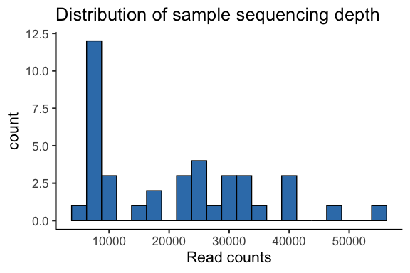
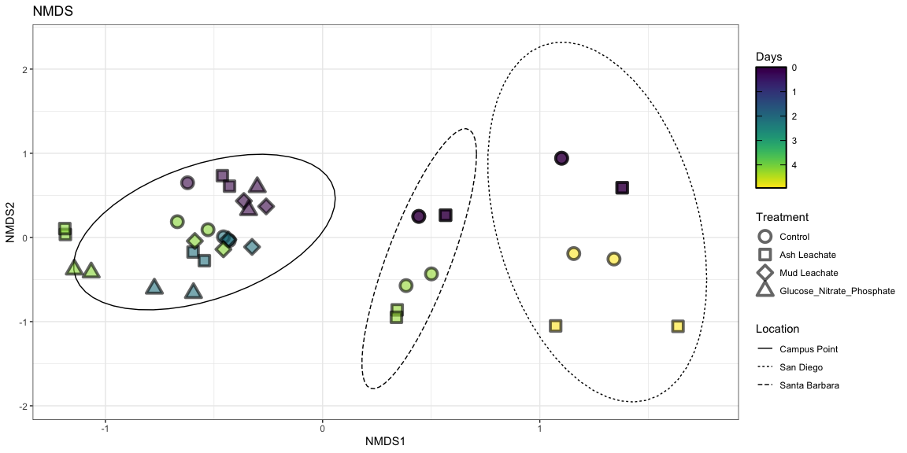
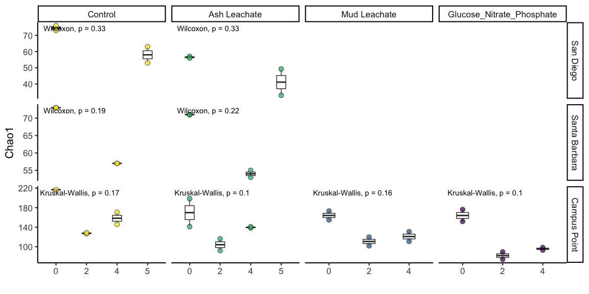
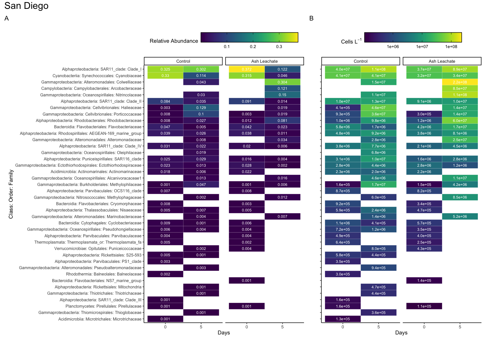
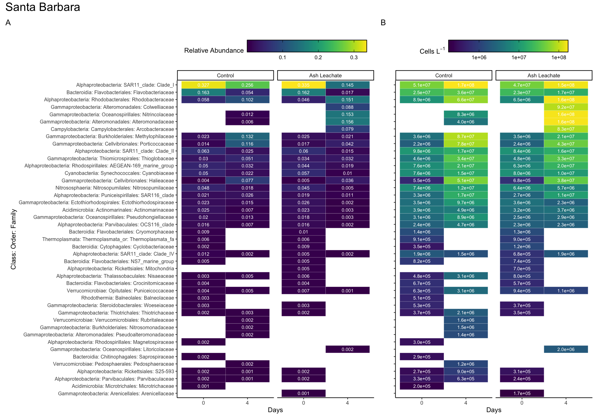
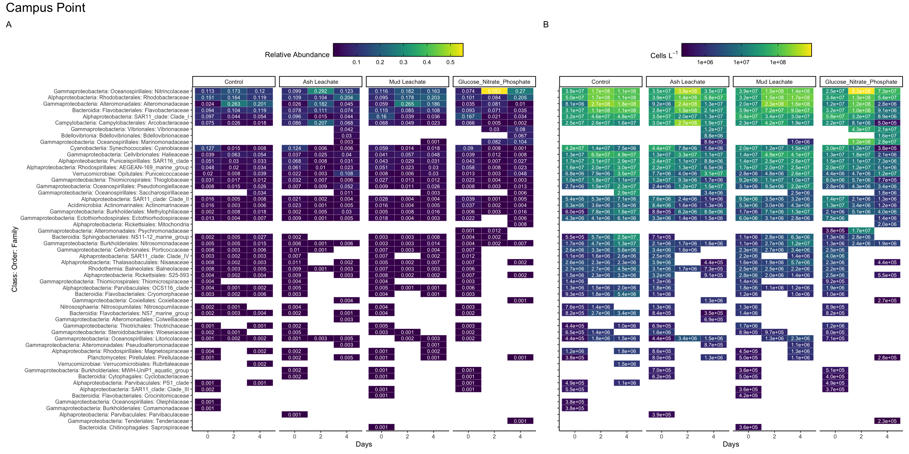

Phyloseq
================
Nicholas Baetge
10/31/2020

# Intro

We explore the processed ACIDD 16S sequences using
[phyloseq](https://joey711.github.io/phyloseq/)

# Install phyloseq

``` r
# BiocManager::install("phyloseq")
```

``` r
library(tidyverse) 
library(phyloseq)
library(RColorBrewer)
library(ggpubr)
library(viridis)
```

# Import Data

``` r
count.tab <- read_rds("~/GITHUB/acidd_remins/output/seqtab-nochimtaxa.rds") #table of counts for each sequence in each sample
tax.tab <- read_rds("~/GITHUB/acidd_remins/output/taxa.rds") #table that matches ASV to sequence
sample.tab <- read_rds("~/GITHUB/acidd_remins/input/tidy_combined_data.rds") %>% 
  drop_na(DNA_SampleID) %>% 
  column_to_rownames(var = "DNA_SampleID") 
```

# Phyloseq Object

We need to create a phyloseq object that merges all three datasets.
Sometimes this doesn’t work beacuse of the format of the data files.
Make sure all the sample names between the sampleinfo.txt and
seqtab-nochimtaxa.txt are the same

``` r
OTU = otu_table(count.tab, taxa_are_rows = TRUE) 
TAX = tax_table(tax.tab)
SAM = sample_data(sample.tab)
ps = phyloseq(OTU,TAX,SAM) 
```

# Filter sequences

We will filter out chloroplasts and mitochondria, because we only
intended to amplify bacterial sequences. It’s good to check you don’t
have anything lurking in the taxonomy table.

``` r
sub_ps <- ps %>%
  # subset_samples(Experiment == "ASH172") %>%  #use this function if you want to only include some subset of your sample set in the subsequent analysis
  subset_taxa(Family  != "mitochondria" & Order  != "Chloroplast")
```

# Sample Summary

As a first analysis, we will look at the distribution of read counts
from our
samples



``` r
# mean, max and min of sample read counts
smin <- min(sample_sums(sub_ps)) 
smean <- mean(sample_sums(sub_ps)) 
smax <- max(sample_sums(sub_ps))
```

# Beta Diversity

Beta diversity involves calculating metrics such as distances or
dissimilarities based on pairwise comparisons of samples – they don’t
exist for a single sample, but rather only as metrics that relate
samples to each other. i.e. beta diversity = patterns in community
structure between samples

Since differences in sampling depths between samples can influence
distance/dissimilarity metrics, we first need to somehow normalize the
read depth across our samples.

## Subsample

We will rarefy (random subsample with replacement) the read depth of the
samples first (scale to the smallest library size).

[Case for not
subsampling](https://journals.plos.org/ploscompbiol/article?id=10.1371/journal.pcbi.1003531)

[Response blog for
subsampling](https://www.polarmicrobes.org/how-i-learned-to-stop-worrying-and-love-subsampling-rarifying/)

Read depth is an artifact of a machine made by a company in San Diego,
not anything about your samples or their biology. It is totally
artifactual, and controlling for artifacts is critical in science.
Subsampling randomly is the simplest way to control for this, and the
question is whether this is the “best” way of controlling for it. See
links above for alternative arguments about what the best way of
controlling for this artifact is.

A strong reason to subsample is to standardize effort. The bottom line
is that in all experimental design you should not be comparing things to
which you devote different effort in resolution. For instance, you don’t
sample one site once a week and another once a month if you want to
compare the dynamics between the sites. You standardize effort.

With that said, the bigger your differential in mean (or median) read
depth (reads/sample) between pre- and post-subsampling, the greater the
“effect” on beta diversity.

Examples:

  - means reads before = 40k, mean reads after = 1k, big effect.
  - mean reads before = 40k, mean reads after = 20k, small effect.
  - mean reads before = 2k, mean reads after = 1k, small effect.

We will subsample to the minimum read depth of all samples and not
subsample. We’ll then compare the mean reads pre- and post-subsampling
and also compare beta diversity
patterns

``` r
ps_min <-  rarefy_even_depth(sub_ps, sample.size = smin, rngseed = 532898)
```

    ## `set.seed(532898)` was used to initialize repeatable random subsampling.

    ## Please record this for your records so others can reproduce.

    ## Try `set.seed(532898); .Random.seed` for the full vector

    ## ...

    ## 53OTUs were removed because they are no longer 
    ## present in any sample after random subsampling

    ## ...

``` r
mean(sample_sums(sub_ps)) #20863
```

    ## [1] 20863.41

``` r
mean(sample_sums(ps_min)) #6100 this is also the same as min(sample_sums(sub)ps) 
```

    ## [1] 6100

## NMDS

One of the best exploratory analyses for amplicon data is unconstrained
ordinations. Here we will look at non-metric multidimensional scaling
(NMDS) ordinations of our full community samples. For NMDS plots it’s
important to set a seed since the starting positions of samples in the
alogrithm is random.

``` r
set.seed(1)
# Ordinate
nmds <- ordinate(sub_ps, method = "NMDS",  distance = "bray") # stress = 0.09
```

    ## Square root transformation
    ## Wisconsin double standardization
    ## Run 0 stress 0.08924146 
    ## Run 1 stress 0.08924146 
    ## ... Procrustes: rmse 6.072619e-06  max resid 1.413857e-05 
    ## ... Similar to previous best
    ## Run 2 stress 0.08924146 
    ## ... Procrustes: rmse 4.389394e-06  max resid 1.390289e-05 
    ## ... Similar to previous best
    ## Run 3 stress 0.1365345 
    ## Run 4 stress 0.08924146 
    ## ... Procrustes: rmse 3.295065e-06  max resid 1.045784e-05 
    ## ... Similar to previous best
    ## Run 5 stress 0.09516286 
    ## Run 6 stress 0.08924146 
    ## ... Procrustes: rmse 9.770415e-06  max resid 2.898796e-05 
    ## ... Similar to previous best
    ## Run 7 stress 0.08924147 
    ## ... Procrustes: rmse 6.580313e-06  max resid 2.556001e-05 
    ## ... Similar to previous best
    ## Run 8 stress 0.08924146 
    ## ... Procrustes: rmse 6.566331e-06  max resid 1.940798e-05 
    ## ... Similar to previous best
    ## Run 9 stress 0.09516286 
    ## Run 10 stress 0.08924146 
    ## ... Procrustes: rmse 3.38051e-06  max resid 8.661254e-06 
    ## ... Similar to previous best
    ## Run 11 stress 0.09516286 
    ## Run 12 stress 0.08924146 
    ## ... Procrustes: rmse 4.953412e-06  max resid 1.526437e-05 
    ## ... Similar to previous best
    ## Run 13 stress 0.1706011 
    ## Run 14 stress 0.08924146 
    ## ... Procrustes: rmse 4.849934e-06  max resid 1.267473e-05 
    ## ... Similar to previous best
    ## Run 15 stress 0.08924146 
    ## ... Procrustes: rmse 1.10453e-06  max resid 2.711636e-06 
    ## ... Similar to previous best
    ## Run 16 stress 0.08924146 
    ## ... Procrustes: rmse 2.746116e-06  max resid 9.189628e-06 
    ## ... Similar to previous best
    ## Run 17 stress 0.1365078 
    ## Run 18 stress 0.3972777 
    ## Run 19 stress 0.08924146 
    ## ... Procrustes: rmse 2.759919e-06  max resid 1.157428e-05 
    ## ... Similar to previous best
    ## Run 20 stress 0.08924146 
    ## ... Procrustes: rmse 6.007909e-06  max resid 2.200352e-05 
    ## ... Similar to previous best
    ## *** Solution reached

``` r
set.seed(1)
# Ordinate
nmds_min <- ordinate(ps_min, method = "NMDS",  distance = "bray") # stress = 0.04
```

    ## Square root transformation
    ## Wisconsin double standardization
    ## Run 0 stress 0.08469709 
    ## Run 1 stress 0.08469709 
    ## ... Procrustes: rmse 5.809559e-06  max resid 2.365425e-05 
    ## ... Similar to previous best
    ## Run 2 stress 0.08469709 
    ## ... Procrustes: rmse 6.027908e-06  max resid 2.611415e-05 
    ## ... Similar to previous best
    ## Run 3 stress 0.1398625 
    ## Run 4 stress 0.08469709 
    ## ... Procrustes: rmse 1.001532e-05  max resid 3.537237e-05 
    ## ... Similar to previous best
    ## Run 5 stress 0.08469709 
    ## ... Procrustes: rmse 4.897092e-06  max resid 1.78923e-05 
    ## ... Similar to previous best
    ## Run 6 stress 0.08469709 
    ## ... New best solution
    ## ... Procrustes: rmse 4.122683e-06  max resid 1.690914e-05 
    ## ... Similar to previous best
    ## Run 7 stress 0.08469709 
    ## ... New best solution
    ## ... Procrustes: rmse 2.074872e-06  max resid 1.058412e-05 
    ## ... Similar to previous best
    ## Run 8 stress 0.0846971 
    ## ... Procrustes: rmse 7.620853e-06  max resid 3.624927e-05 
    ## ... Similar to previous best
    ## Run 9 stress 0.08469709 
    ## ... Procrustes: rmse 3.229111e-06  max resid 1.411068e-05 
    ## ... Similar to previous best
    ## Run 10 stress 0.08469709 
    ## ... Procrustes: rmse 6.531579e-06  max resid 2.12982e-05 
    ## ... Similar to previous best
    ## Run 11 stress 0.08469709 
    ## ... Procrustes: rmse 3.362563e-06  max resid 7.834347e-06 
    ## ... Similar to previous best
    ## Run 12 stress 0.08469709 
    ## ... Procrustes: rmse 9.316336e-06  max resid 3.321209e-05 
    ## ... Similar to previous best
    ## Run 13 stress 0.13951 
    ## Run 14 stress 0.08469709 
    ## ... Procrustes: rmse 4.500003e-06  max resid 2.435588e-05 
    ## ... Similar to previous best
    ## Run 15 stress 0.1395087 
    ## Run 16 stress 0.08469709 
    ## ... Procrustes: rmse 3.685296e-06  max resid 1.760612e-05 
    ## ... Similar to previous best
    ## Run 17 stress 0.08469709 
    ## ... Procrustes: rmse 3.715821e-06  max resid 1.81708e-05 
    ## ... Similar to previous best
    ## Run 18 stress 0.398265 
    ## Run 19 stress 0.08469709 
    ## ... Procrustes: rmse 8.078333e-06  max resid 3.813796e-05 
    ## ... Similar to previous best
    ## Run 20 stress 0.08469709 
    ## ... Procrustes: rmse 6.249665e-06  max resid 2.953072e-05 
    ## ... Similar to previous best
    ## *** Solution reached



NMDS plots attempt to show ordinal distances between samples as
accurately as possible in two dimensions. It is important to report the
stress of these plots, because a high stress value means that the
algorithm had a hard time representing the distances between samples in
2 dimensions. The stress of this plot was good - it was .09 (generally
anything below .2 is considered acceptable).

# Betadisper and permutational ANOVA

Above, we performed beta diversity analyses on Bray-Curtis distances on
rarefied datasets that were then visualized using NMDS. We can test if
there are statistically significant differences between sample groups
using the betadisper and adonis functions of the vegan package.
Betadisper tests whether two or more groups are homogeneously dispersed
in relation to their species in studied samples. This test can be done
to see if one group has more compositional variance than another.
Moreover, homogeneity of dispersion among groups is very advisable to
have if you want to test if two or more groups have different
compositions, which is tested by adonis.

## Phyloseq to DESeq, distance matrix

To be able to run the stats, we first have to create a distance matrix
from our data. We’ll use the DESeq package to do so.

``` r
library(DESeq2)
library(vegan)
```

``` r
deseq_counts <- phyloseq_to_deseq2(ps_min, design = ~Location ) #the design argument is required but doesn't matter here
```

    ## converting counts to integer mode

    ## Warning in DESeqDataSet(se, design = design, ignoreRank): some variables in
    ## design formula are characters, converting to factors

    ##   Note: levels of factors in the design contain characters other than
    ##   letters, numbers, '_' and '.'. It is recommended (but not required) to use
    ##   only letters, numbers, and delimiters '_' or '.', as these are safe characters
    ##   for column names in R. [This is a message, not a warning or an error]

``` r
deseq_count_tab <- assay(deseq_counts) #extract the read count matrix
```

We’ll calculate bray-curtis distances, which reflect the NMDS
ordinations
above

``` r
#We can subset our data if we want to and calculate distances/run stats for only a subset of the group. The code below shows how

ash1_sample.tab <- sample.tab %>%
  rownames_to_column() %>% 
  filter(Experiment %in% c("ASH171")) %>% 
  column_to_rownames(var = "rowname")


subset_sample_IDs_ash1 <-  row.names(ash1_sample.tab)

dist_ash1 <- vegdist(t(deseq_count_tab[ , colnames(deseq_count_tab) %in% subset_sample_IDs_ash1]), method = "bray")

sample_info_tab_ash1 <- ash1_sample.tab[row.names(ash1_sample.tab) %in% subset_sample_IDs_ash1, ]

####

ash2_sample.tab <- sample.tab %>%
  rownames_to_column() %>% 
  filter(Experiment %in% c("ASH172")) %>% 
  column_to_rownames(var = "rowname")


subset_sample_IDs_ash2 <-  row.names(ash2_sample.tab)

dist_ash2 <- vegdist(t(deseq_count_tab[ , colnames(deseq_count_tab) %in% subset_sample_IDs_ash2]), method = "bray")

sample_info_tab_ash2 <- ash2_sample.tab[row.names(ash2_sample.tab) %in% subset_sample_IDs_ash2, ]

####

lab_sample.tab <- sample.tab %>%
  rownames_to_column() %>% 
  filter(Experiment %in% c("144L_2018")) %>% 
  filter(!Bottle == "B" | !days == 0) %>% 
  column_to_rownames(var = "rowname")


subset_sample_IDs_lab <-  row.names(lab_sample.tab)

dist_lab <- vegdist(t(deseq_count_tab[ , colnames(deseq_count_tab) %in% subset_sample_IDs_lab]), method = "bray")

sample_info_tab_lab <- lab_sample.tab[row.names(lab_sample.tab) %in% subset_sample_IDs_lab, ]
```

Betadisper first calculates the average distance of group members to the
group centroid in multivariate space (generated by a distance matrix).

In the function below: we are using the distance matrix to calculate the
multivariate dispersions (variances; average distance to centroids). We
then use group dispersions to perform an ANOVA test.

``` r
anova(betadisper(dist_ash1, sample_info_tab_ash1$days)) 
```

    ## Analysis of Variance Table
    ## 
    ## Response: Distances
    ##           Df   Sum Sq  Mean Sq F value  Pr(>F)  
    ## Groups     1 0.117420 0.117420  13.582 0.01026 *
    ## Residuals  6 0.051871 0.008645                  
    ## ---
    ## Signif. codes:  0 '***' 0.001 '**' 0.01 '*' 0.05 '.' 0.1 ' ' 1

The ANOVA’s p-value is significant meaning that group dispersions are
not homogenous (“Null hypothesis of no difference in dispersion between
groups”)

``` r
anova(betadisper(dist_ash2, sample_info_tab_ash2$days)) 
```

    ## Analysis of Variance Table
    ## 
    ## Response: Distances
    ##           Df   Sum Sq  Mean Sq F value  Pr(>F)    
    ## Groups     1 0.086672 0.086672  389.24 1.1e-06 ***
    ## Residuals  6 0.001336 0.000223                    
    ## ---
    ## Signif. codes:  0 '***' 0.001 '**' 0.01 '*' 0.05 '.' 0.1 ' ' 1

``` r
anova(betadisper(dist_lab, sample_info_tab_lab$days)) 
```

    ## Analysis of Variance Table
    ## 
    ## Response: Distances
    ##           Df   Sum Sq   Mean Sq F value Pr(>F)
    ## Groups     2 0.035984 0.0179919  1.9955 0.1621
    ## Residuals 20 0.180327 0.0090163

\*\*Our groups for the 144L exp (days) do present homogeneity among
group dispersions (compositions vary similarly).

``` r
adonis(dist_lab~sample_info_tab_lab$days)
```

    ## 
    ## Call:
    ## adonis(formula = dist_lab ~ sample_info_tab_lab$days) 
    ## 
    ## Permutation: free
    ## Number of permutations: 999
    ## 
    ## Terms added sequentially (first to last)
    ## 
    ##                          Df SumsOfSqs MeanSqs F.Model      R2 Pr(>F)    
    ## sample_info_tab_lab$days  1   0.84319 0.84319   9.014 0.30033  0.001 ***
    ## Residuals                21   1.96439 0.09354         0.69967           
    ## Total                    22   2.80758                 1.00000           
    ## ---
    ## Signif. codes:  0 '***' 0.001 '**' 0.01 '*' 0.05 '.' 0.1 ' ' 1

Adonis analyzes and partitions sums of squares using distance matrices.
It can be seen as an ANOVA using distance matrices (analogous to MANOVA
– multivariate analysis of variance). Therefore, it is used to test if
two or more groups have similar compositions.

\*\*Our groups (days) for the 144L exp present homogeneity among group
dispersions (compositions vary similarly) and have significantly
different compositions.

# Alpha Diversity

We are going to calculate the the Chao1 diversity index.

**it is important to note that the alpha diversity values are not
interpretable as “real” numbers of anything (due to the nature of
amplicon data), but they can still be useful as relative metrics of
comparison.**

[Chao1: nonparametric estimation of minimum community
richness](https://www.jstor.org/stable/4615964?seq=1#metadata_info_tab_contents)

``` r
richness <- estimate_richness(ps_min, measures = c("Chao1", "Shannon")) %>% 
  rownames_to_column(., var = "DNA_ID") %>% 
  mutate_at(vars(DNA_ID), str_replace_all, pattern = "171.", "171-") %>% 
   mutate_at(vars(DNA_ID), str_replace_all, pattern = "172.", "172-") %>% 
   mutate_at(vars(DNA_ID), str_replace_all, pattern = "X", "")
```

Let’s add the sample metadata into this
dataframe

``` r
alphadiv <- left_join(richness, sample.tab %>% rownames_to_column(., var = "DNA_ID")) 
```

    ## Joining, by = "DNA_ID"



Boxes represent the 1.5 interquartile range, with the internal solid
line representing the median. Circles represent data points. p-values
are reported the non-parametric two sample Wilcoxon test, which tests
whether the means between two groups are equal (ns: p \> 0.05, \* : p≤
0.05, \*\* : p ≤ 0.01).

Difference in the alpha diversity index among conditions were tested
using pairwise Wilcoxon or Kruskal-Wallis tests; p \< 0.05 was
considered the threshold significance for a difference between
conditions.

# Who??

Which taxa were important? Which taxa were contributing to the change in
community compositon?

**Note: Recovered 16S rRNA gene copy numbers do not equal organism
abundance.**

That said, we can generate a heat map of our samples showing us how the
relative abundance of different taxonomic groups change…potentially
giving us a visual of which taxa are most important to the alpha and
beta diversity patterns we observed. First, we’re going to generate a
custom table that will be easier to work with than a phyloseq object.

## Generate relative abundances

Our data currently shows number gene copies recovered, so we’ll convert
to percentages (relative abundances)

``` r
ps_std <- transform_sample_counts(ps_min, function(x) x/sum(x))
#extract the relative abundance table and coerce into dataframe
ps_std.tab <- as(otu_table(ps_std), "matrix")
ps_std.df = as.data.frame(ps_std.tab) 
```

## Make table

``` r
#first coerce the taxa table into a data frame
tax.df <-  as.data.frame(tax.tab) 
#then combine the data frames
custom.tab <- tax.df %>% 
  rownames_to_column(., var = "asv") %>% 
  left_join(., ps_std.df %>% rownames_to_column(., var = "asv")) %>% 
  #create a new index of that combines the  class, order, family, and genus values, you can play around here!!
  mutate(pcof = paste(Phylum, "_", Class, "_", Order,"_", Family)) %>% 
         # pco = paste(Phylum, "_", Class, "_", Order)) %>% 
  select(-c(asv:Genus)) %>% 
  select(pcof,everything()) %>%
  group_by(pcof) %>%
  # select(pco,everything()) %>% 
  # group_by(pco) %>% 
  #here we are combining the relative abundances based on our grouping
  summarise_at(vars(contains(c("ASH171", "ASH172", "144"))), sum, na.rm = T) %>% 
  ungroup()
```

    ## Joining, by = "asv"

``` r
#save the row names and then make them into the column names
colnames <- custom.tab[,1] 

#transpose the dataframe so we can merge with the sample info table
t_custom.tab <-  as.data.frame(t(custom.tab[,-1]))
colnames(t_custom.tab) <- colnames$pcof
# colnames(t_custom.tab) <- colnames$pco

#merge
sweet.tab <- t_custom.tab %>% 
  rownames_to_column(., var = "sample") %>% 
  left_join(., sample.tab %>% rownames_to_column(., var = "sample") %>% select(sample, everything())) %>% 
  select(sample, Experiment:sd_PTOC, everything())
```

    ## Joining, by = "sample"

``` r
relabund <- sweet.tab %>% 
  select(-c(sample:sd_PTOC)) %>% 
  #remove groups that are completely absent
  .[ , colSums(.) > 0] %>% 
  #arrange by biggest contributors
  .[, order(colSums(-.))] %>% 
  bind_cols(sweet.tab %>% select(sample:sd_PTOC), .)
```

## Heatmaps

``` r
sb_relaheat_cof <- relaheat.data %>%
  filter(Location == "Santa Barbara") %>% 
  select(Location, Treatment, days, cof, contains(c("mean","sd"))) %>% 
  distinct() %>% 
  filter(mean_relabund > 0.001) %>%
  ggplot(aes(x = as.character(round(days)), y = reorder(cof, mean_relabund), group = interaction(Treatment, days))) +
  geom_tile(aes(fill = mean_relabund), color = "white") +
  scale_fill_viridis(option = "D", begin = 0.01) +
    geom_text(aes(label = round(mean_relabund, 3)), color = "white", size = 4) +
  labs(x = "Days", y = "Class: Order: Family", fill = "Relative Abundance") +
  facet_grid(~factor(Treatment, levels = levels)) +
  theme_classic2(base_size = 16) +
  theme(axis.text.y = element_text(size = 12), legend.position = "top") +
   guides(fill = guide_colourbar(barheight = 2, barwidth = 20, frame.colour = "black", frame.linewidth = 2,ticks.colour = "black", ticks.linewidth = 1), color = F) +
  ggtitle("Santa Barbara")
```

``` r
cp_relaheat_cof <- relaheat.data %>%
  filter(Location == "Campus Point") %>% 
  select(Location, Treatment, days, cof, contains(c("mean","sd"))) %>% 
  distinct() %>% 
  filter(mean_relabund > 0.001) %>%
  ggplot(aes(x = as.character(round(days)), y = reorder(cof, mean_relabund), group = interaction(Treatment, days))) +
  geom_tile(aes(fill = mean_relabund), color = "white") +
  scale_fill_viridis(option = "D", begin = 0.01) +
    geom_text(aes(label = round(mean_relabund, 3)), color = "white", size = 4) +
  labs(x = "Days", y = "Class: Order: Family", fill = "Relative Abundance") +
  facet_grid(~factor(Treatment, levels = levels)) +
  theme_classic2(base_size = 16) +
  theme(axis.text.y = element_text(size = 12), legend.position = "top") +
   guides(fill = guide_colourbar(barheight = 2, barwidth = 20, frame.colour = "black", frame.linewidth = 2,ticks.colour = "black", ticks.linewidth = 1), color = F) +
  ggtitle("Campus Point")
```

``` r
sd_counts_cof <- relaheat.data %>%
  filter(Location == "San Diego") %>% 
  select(Location, Treatment, days, cof, contains(c("mean","sd"))) %>% 
  distinct() %>% 
  filter(mean_relabund > 0.001) %>%
  ggplot(aes(x = as.character(round(days)), y = reorder(cof, mean_relabund), group = interaction(Treatment, days))) +
  geom_tile(aes(fill = mean_absabund), color = "white") +
  scale_fill_viridis(option = "D", trans = "log10") +
  geom_text(aes(label = formatC(mean_absabund, format = "e", digits = 1)), color = "white", size = 4) +
  labs(x = "Days", y = "", fill = expression(paste("Cells L"^-1))) +
  facet_grid(~factor(Treatment, levels = levels)) +
  theme_classic2(base_size = 16) +
  theme(axis.text.y = element_text(size = 12), legend.position = "top") +
   guides(fill = guide_colourbar(barheight = 2, barwidth = 20, frame.colour = "black", frame.linewidth = 2,ticks.colour = "black", ticks.linewidth = 1), color = F) +
  ggtitle("San Diego") +
  theme( legend.position = "top", axis.text.y = element_blank()) 
```

``` r
sb_counts_cof <- relaheat.data %>%
  filter(Location == "Santa Barbara") %>% 
  select(Location, Treatment, days, cof, contains(c("mean","sd"))) %>% 
  distinct() %>% 
  filter(mean_relabund > 0.001) %>%
  ggplot(aes(x = as.character(round(days)), y = reorder(cof, mean_relabund), group = interaction(Treatment, days))) +
  geom_tile(aes(fill = mean_absabund), color = "white") +
  scale_fill_viridis(option = "D", trans = "log10") +
  geom_text(aes(label = formatC(mean_absabund, format = "e", digits = 1)), color = "white", size = 4) +
  labs(x = "Days", y = "", fill = expression(paste("Cells L"^-1))) +
  facet_grid(~factor(Treatment, levels = levels)) +
  theme_classic2(base_size = 16) +
  theme(axis.text.y = element_text(size = 12), legend.position = "top") +
   guides(fill = guide_colourbar(barheight = 2, barwidth = 20, frame.colour = "black", frame.linewidth = 2,ticks.colour = "black", ticks.linewidth = 1), color = F) +
  ggtitle("Santa Barbara") +
  theme( legend.position = "top", axis.text.y = element_blank())
```

``` r
cp_counts_cof <- relaheat.data %>%
  filter(Location == "Campus Point") %>% 
  select(Location, Treatment, days, cof, contains(c("mean","sd"))) %>% 
  distinct() %>% 
  filter(mean_relabund > 0.001) %>%
  ggplot(aes(x = as.character(round(days)), y = reorder(cof, mean_relabund), group = interaction(Treatment, days))) +
  geom_tile(aes(fill = mean_absabund), color = "white") +
  scale_fill_viridis(option = "D", trans = "log10") +
  geom_text(aes(label = formatC(mean_absabund, format = "e", digits = 1)), color = "white", size = 4) +
  labs(x = "Days", y = "", fill = expression(paste("Cells L"^-1))) +
  facet_grid(~factor(Treatment, levels = levels)) +
  theme_classic2(base_size = 16) +
  theme(axis.text.y = element_text(size = 12), legend.position = "top") +
   guides(fill = guide_colourbar(barheight = 2, barwidth = 20, frame.colour = "black", frame.linewidth = 2,ticks.colour = "black", ticks.linewidth = 1), color = F) +
  ggtitle("Campus Point") + 
  theme( legend.position = "top", axis.text.y = element_blank())
```

``` r
library(patchwork)
```

``` r
(sd_relaheat_cof + ggtitle("")) + (sd_counts_cof + ggtitle("")) + plot_annotation(title = 'San Diego', tag_levels = 'A', theme = theme(plot.title = element_text(size = 28), plot.tag = element_text(size = 18)))
```

<!-- -->

``` r
(sb_relaheat_cof + ggtitle("")) + (sb_counts_cof + ggtitle("")) + plot_annotation(title = 'Santa Barbara', tag_levels = 'A', theme = theme(plot.title = element_text(size = 28), plot.tag = element_text(size = 18)))
```

<!-- -->

``` r
(cp_relaheat_cof + ggtitle("")) + (cp_counts_cof + ggtitle("")) + plot_annotation(title = 'Campus Point', tag_levels = 'A', theme = theme(plot.title = element_text(size = 28), plot.tag = element_text(size = 18)))
```

<!-- -->

# Save and knit

``` r
saveRDS(sweet.tab, "~/GITHUB/acidd_remins/output/Custom_ASV_Table.rds")
saveRDS(sub_ps, "~/GITHUB/acidd_remins/output/phyloseq_obj.rds")
saveRDS(ps_min, "~/GITHUB/acidd_remins/output/subsampled_phyloseq_obj.rds")
saveRDS(alphadiv, "~/GITHUB/acidd_remins/output/alphadiv.rds")
saveRDS(relaheat.data, "~/GITHUB/acidd_remins/output/heatmap_data.rds")
```
